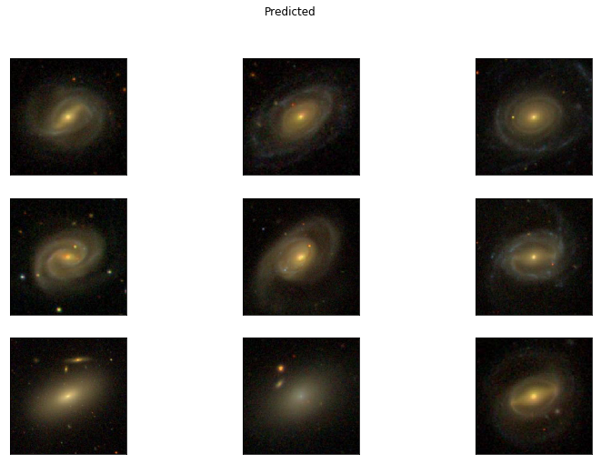

# Find similar galaxies using autoencoder
Train simple convolution autoencoder for getting vector representation of galaxy image. Then find similar vectors with cosine or l2 metrics and respectively image.
## Install
```console
git clone https://github.com/mikeedi/galaxy.git
pip3 install -r requirements.txt
```
## Predict
Main file for predicting: `predict.py`  
Arguments: image_path: path to image   
weights: path to model weights   
code_size: size of vector representation  
device: gpu or cpu  
num: num of predicted images  
random_rotate: the autoencoder is not invariant for rotation, then needed to rotate of source image  
```console
python3 predict.py --weights models/encoder.32.pth --code-size 32  --image-path examples/587729752748982355.jpg  --device cpu --num 10 --random_rotate True
```  
Then galaxy from `data/` that mostly similar to source save in folder `587729752748982355/`. Also saves file with coordinates:  
```
#ID RA DEC similarity-value
587729752748982355 258.05683 30.16783 0.0
587731913110847523 141.53933 49.31019 0.22692
587735666916261999 212.08983 55.30147 0.23528
588017947213037603 210.03842 38.67322 0.2643
587736941990248578 236.00633 28.27703 0.26821
588013383811924105 162.97379 51.0065 0.27399
587729386608787500 153.92604 55.66747 0.2773
588017702932119597 None None 0.2775
587738066188763228 112.31933 42.27964 0.2921
587734304877641984 332.9705 0.10872 0.29448
```
`None` - unknown coordinates  
`0.0`  - probably source image contains in `data/`  
  
Also see [use_examples.ipynb](https://github.com/mikeedi/galaxy/blob/master/use_examples.ipynb)
### Example

* source image 
* predicted images 